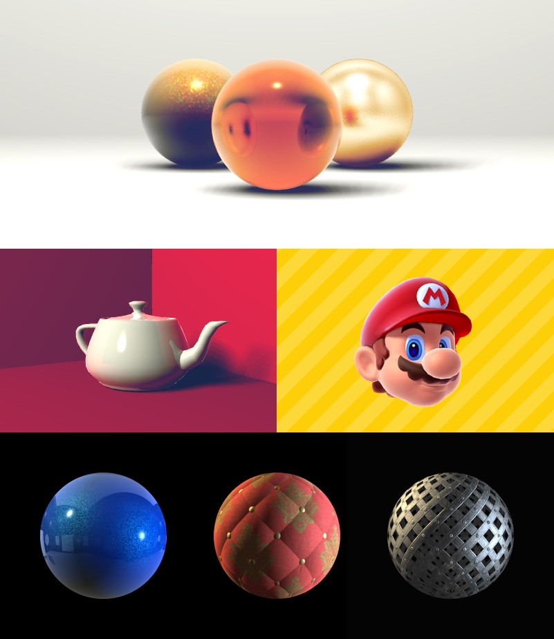

# RayTracer

F# implementation of [The Ray Tracer Challenge](https://pragprog.com/book/jbtracer/the-ray-tracer-challenge) by James Buck. If you haven't done the challenge you should! 🚀 It's tons of fun.

## Extracurricular stuff

- Soft shadows
- Composable materials
- Fresnel reflections
- Textures (UV mapped)
  - Color, specular, ambient occlusion and alpha channels
  - Normal bump mapping
- Ambient occlusion
- Antialiasing

## Prerequisites

[.NET Core](https://dotnet.microsoft.com/download)

`mono-libgdiplus` if you're on a mac. [More here](https://medium.com/@hudsonmendes/solved-system-drawing-netcore-on-mac-gdiplus-exception-c455ab3655a2)

## Usage

`dotnet run` in `RayTracer` directory.
Choose what scene to render in `RayTracer/Program.fs`. Existing scenes are in `RayTracer/Scenes`.
